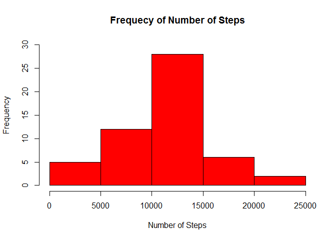
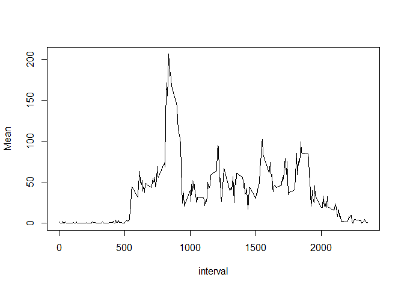
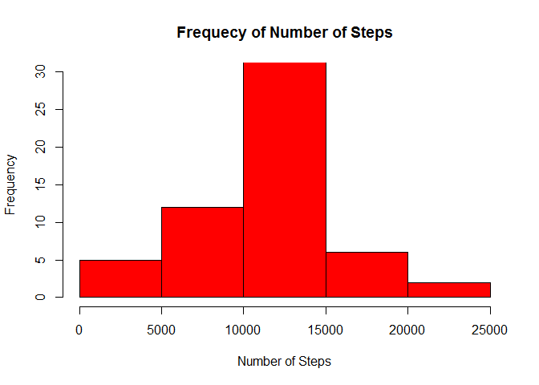
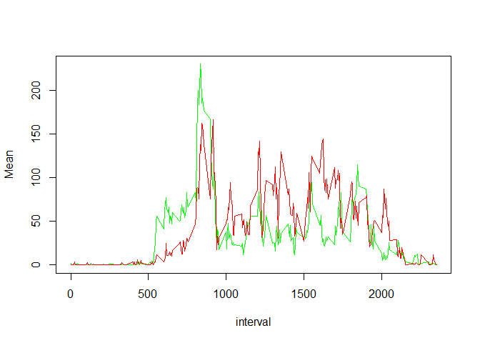

# Reproducible Research: Peer Assessment 1


## Loading and preprocessing the data

```r
library('dplyr')
```

```
## 
## Attaching package: 'dplyr'
```

```
## The following objects are masked from 'package:stats':
## 
##     filter, lag
```

```
## The following objects are masked from 'package:base':
## 
##     intersect, setdiff, setequal, union
```

```r
library('lattice')
activity <- read.csv("activity.csv")
good <- complete.cases(activity)
activity_NA <- activity[!good, ]
activity <- activity[good, ]
```

## What is mean total number of steps taken per day?

```r
activity_day <- transmute(activity, steps = steps, day = as.Date(date))
activity_group_day <- group_by(activity_day, day)
activity_summary_day <- summarize(activity_group_day, total = sum(steps), Mean = mean(steps), Median = median(steps))
hist(activity_summary_day[[2]], main = 'Frequecy of Number of Steps', col = 'Red', xlab = 'Number of Steps', ylim = c(0, 30))
```

<!-- -->

```r
print.data.frame(transmute(activity_summary_day, Day = day, Mean = Mean, Median = Median), row.names=FALSE)
```

```
##         Day       Mean Median
##  2012-10-02  0.4375000      0
##  2012-10-03 39.4166667      0
##  2012-10-04 42.0694444      0
##  2012-10-05 46.1597222      0
##  2012-10-06 53.5416667      0
##  2012-10-07 38.2465278      0
##  2012-10-09 44.4826389      0
##  2012-10-10 34.3750000      0
##  2012-10-11 35.7777778      0
##  2012-10-12 60.3541667      0
##  2012-10-13 43.1458333      0
##  2012-10-14 52.4236111      0
##  2012-10-15 35.2048611      0
##  2012-10-16 52.3750000      0
##  2012-10-17 46.7083333      0
##  2012-10-18 34.9166667      0
##  2012-10-19 41.0729167      0
##  2012-10-20 36.0937500      0
##  2012-10-21 30.6284722      0
##  2012-10-22 46.7361111      0
##  2012-10-23 30.9652778      0
##  2012-10-24 29.0104167      0
##  2012-10-25  8.6527778      0
##  2012-10-26 23.5347222      0
##  2012-10-27 35.1354167      0
##  2012-10-28 39.7847222      0
##  2012-10-29 17.4236111      0
##  2012-10-30 34.0937500      0
##  2012-10-31 53.5208333      0
##  2012-11-02 36.8055556      0
##  2012-11-03 36.7048611      0
##  2012-11-05 36.2465278      0
##  2012-11-06 28.9375000      0
##  2012-11-07 44.7326389      0
##  2012-11-08 11.1770833      0
##  2012-11-11 43.7777778      0
##  2012-11-12 37.3784722      0
##  2012-11-13 25.4722222      0
##  2012-11-15  0.1423611      0
##  2012-11-16 18.8923611      0
##  2012-11-17 49.7881944      0
##  2012-11-18 52.4652778      0
##  2012-11-19 30.6979167      0
##  2012-11-20 15.5277778      0
##  2012-11-21 44.3993056      0
##  2012-11-22 70.9270833      0
##  2012-11-23 73.5902778      0
##  2012-11-24 50.2708333      0
##  2012-11-25 41.0902778      0
##  2012-11-26 38.7569444      0
##  2012-11-27 47.3819444      0
##  2012-11-28 35.3576389      0
##  2012-11-29 24.4687500      0
```
The median values are all . This is because most of the itervalls per day do have 0 steps.
## What is the average daily activity pattern?

```r
activity_group_interval <- group_by(activity, interval)
activity_summary_interval <- as.data.frame(summarize(activity_group_interval, Mean = mean(steps)))
plot(activity_summary_interval, type = 'l')
```

<!-- -->

```r
max_mean_steps <- activity_summary_interval[activity_summary_interval$Mean == max(activity_summary_interval$Mean), ]$interval
```
The maximum number of steps is 835. 

## Imputing missing values

```r
num_row <- nrow(activity_NA)
for(i in 1:nrow(activity_NA)){
        steps <- activity_summary_interval[activity_summary_interval$interval == activity_NA[i, ]$interval, ]$Mean
        activity_NA[i, ]$steps <- steps
}

activity_new <- rbind(activity, activity_NA)

activity_new_day <- transmute(activity_new, steps = steps, day = as.Date(date))
activity_new_group_day <- group_by(activity_new_day, day)
activity_new_summary_day <- summarize(activity_new_group_day, total = sum(steps), Mean = mean(steps), Median = median(steps))

hist(activity_new_summary_day[[2]], main = 'Frequecy of Number of Steps', col = 'Red', xlab = 'Number of Steps', ylim = c(0, 30))
```

<!-- -->

```r
print.data.frame(transmute(activity_new_summary_day, Day = day, Mean = Mean, Median = Median), row.names=FALSE)
```

```
##         Day       Mean   Median
##  2012-10-01 37.3825996 34.11321
##  2012-10-02  0.4375000  0.00000
##  2012-10-03 39.4166667  0.00000
##  2012-10-04 42.0694444  0.00000
##  2012-10-05 46.1597222  0.00000
##  2012-10-06 53.5416667  0.00000
##  2012-10-07 38.2465278  0.00000
##  2012-10-08 37.3825996 34.11321
##  2012-10-09 44.4826389  0.00000
##  2012-10-10 34.3750000  0.00000
##  2012-10-11 35.7777778  0.00000
##  2012-10-12 60.3541667  0.00000
##  2012-10-13 43.1458333  0.00000
##  2012-10-14 52.4236111  0.00000
##  2012-10-15 35.2048611  0.00000
##  2012-10-16 52.3750000  0.00000
##  2012-10-17 46.7083333  0.00000
##  2012-10-18 34.9166667  0.00000
##  2012-10-19 41.0729167  0.00000
##  2012-10-20 36.0937500  0.00000
##  2012-10-21 30.6284722  0.00000
##  2012-10-22 46.7361111  0.00000
##  2012-10-23 30.9652778  0.00000
##  2012-10-24 29.0104167  0.00000
##  2012-10-25  8.6527778  0.00000
##  2012-10-26 23.5347222  0.00000
##  2012-10-27 35.1354167  0.00000
##  2012-10-28 39.7847222  0.00000
##  2012-10-29 17.4236111  0.00000
##  2012-10-30 34.0937500  0.00000
##  2012-10-31 53.5208333  0.00000
##  2012-11-01 37.3825996 34.11321
##  2012-11-02 36.8055556  0.00000
##  2012-11-03 36.7048611  0.00000
##  2012-11-04 37.3825996 34.11321
##  2012-11-05 36.2465278  0.00000
##  2012-11-06 28.9375000  0.00000
##  2012-11-07 44.7326389  0.00000
##  2012-11-08 11.1770833  0.00000
##  2012-11-09 37.3825996 34.11321
##  2012-11-10 37.3825996 34.11321
##  2012-11-11 43.7777778  0.00000
##  2012-11-12 37.3784722  0.00000
##  2012-11-13 25.4722222  0.00000
##  2012-11-14 37.3825996 34.11321
##  2012-11-15  0.1423611  0.00000
##  2012-11-16 18.8923611  0.00000
##  2012-11-17 49.7881944  0.00000
##  2012-11-18 52.4652778  0.00000
##  2012-11-19 30.6979167  0.00000
##  2012-11-20 15.5277778  0.00000
##  2012-11-21 44.3993056  0.00000
##  2012-11-22 70.9270833  0.00000
##  2012-11-23 73.5902778  0.00000
##  2012-11-24 50.2708333  0.00000
##  2012-11-25 41.0902778  0.00000
##  2012-11-26 38.7569444  0.00000
##  2012-11-27 47.3819444  0.00000
##  2012-11-28 35.3576389  0.00000
##  2012-11-29 24.4687500  0.00000
##  2012-11-30 37.3825996 34.11321
```
The total number of entries with missing values is 2304.
The overall pattern of the activities hs not chaged. The number of steps has icreased, because I added the mean of the intervall to the missig values. This is also the reason why the median is now differnt from 0.


## Are there differences in activity patterns between weekdays and weekends?

```r
weekend <- c('Saturday', 'Sunday')
activity_week <- transmute(activity_new, steps = steps, interval = interval, wday = as.factor(weekdays(as.Date(date))))
activity_week_end <- transmute(activity_week, steps = steps, interval = interval, weekend = as.factor(wday %in% weekend))

activity_weekend <- subset(activity_week_end, weekend == TRUE, select = c(steps, interval))
activity_weekday <- subset(activity_week_end, weekend == FALSE, select = c(steps, interval))

activity_group_interval_wd <- group_by(activity_weekday, interval)
activity_summary_interval_wd <- as.data.frame(summarize(activity_group_interval_wd, Mean = mean(steps)))
activity_summary_interval_wd <- transmute(activity_summary_interval_wd, Day = 'Weekday', interval = interval, Mean = Mean)

activity_group_interval_we <- group_by(activity_weekend, interval)
activity_summary_interval_we <- as.data.frame(summarize(activity_group_interval_we, Mean = mean(steps)))
activity_summary_interval_we <- transmute(activity_summary_interval_we, Day = 'Weekend', interval = interval, Mean = Mean)

activity_summary_interval <- rbind(activity_summary_interval_wd, activity_summary_interval_we)
activity_summary_interval <- transmute(activity_summary_interval, Day = as.factor(Day), interval = interval, Mean = Mean)


xyplot(activity_summary_interval$Mean ~ activity_summary_interval$interval | factor(activity_summary_interval$Day), layout = c(1,2),ylab = ('Number of steps'), xlab = ('Interval'), type = 'l' )
```

<!-- -->
